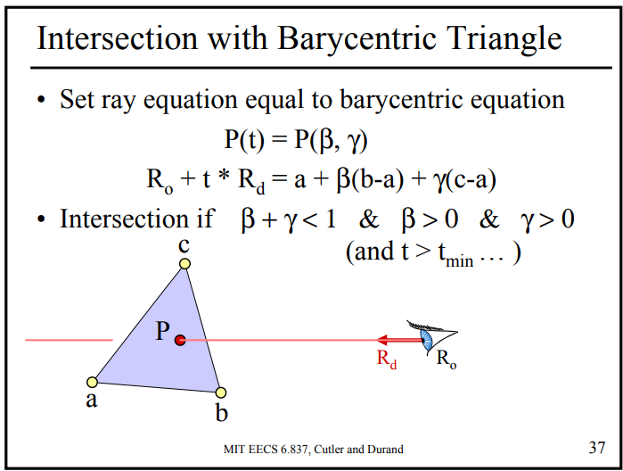
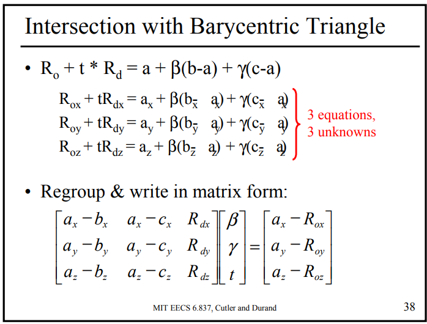

# MIT-6.837 实验报告

孙嘉锴，3180105871

## 目录

[TOC]

## Iterated Function Systems (Assigment 0)

### 实验要求

实现IFS分形系统

### 实验原理


### 源代码与分析

* IFS.h

```c++
#pragma once

#include "image.h"
#include "matrix.h"
#include "vectors.h"
#include <vector>

using namespace std;

class IFS
{
public:
    int n_trans;
    vector<Matrix> trans;
    vector<float> probs;
    vector<int> trans_cnts;
    Vec3f white = Vec3f(255, 255, 255);
    Vec3f black = Vec3f(0, 0, 0);
    IFS() : n_trans(0) {}
    void ifs_read(const char *filename);
    void ifs_render(Image &img, int n_pts, int n_iters);
};
```

* IFS.cpp

```cpp
#pragma once
#include <vector>
#include "image.h"
#include "matrix.h"
#include "IFS.h"

// ====================================================================
// ====================================================================
void IFS::ifs_read(const char* input_file)
{
    FILE *input = fopen(input_file, "r");
    assert(input != NULL);
    int num_transforms;
    fscanf(input, "%d", &num_transforms);
    n_trans = num_transforms;
    for (int i = 0; i < num_transforms; i++)
    {
        float probability;
        fscanf(input, "%f", &probability);
        Matrix m;
        m.Read3x3(input);
        probs.push_back(probability);
        trans.push_back(m);
    }
    fclose(input);
    for (int i = 1; i < n_trans; i++)
    {
        probs[i] += probs[i - 1];
    }
    for (int i = 0; i < n_trans; i++)
    {
        trans_cnts.push_back(0);
    }
}
void IFS::ifs_render(Image& img, int n_pts, int n_iters)
{
    img.SetAllPixels(white);
    for (int n = 0; n < n_pts; n++)
    {
        //For lots of random points...
        int x = rand() % img.Width();
        int y = rand() % img.Height();
        Vec2f pos = Vec2f(x, y);
        for (int k = 0; k < n_iters; k++)
        {
            //For numbers of iterations
            float sample = rand() / float(RAND_MAX);
            int i = 0;
            for (i = 0; i < n_trans; i++)
            {
                if (sample > probs[i])
                    continue;
                break;
            }
            //Pick a random transform ans use it
            if (i >= n_trans) i = n_trans - 1;
            Vec2f tmp(pos.x() / (float)img.Width(), pos.y() / img.Height());
            trans[i].Transform(tmp);
            pos.Set(tmp.x() * img.Width(), tmp.y() * img.Height());
            trans_cnts[i]++;
        }
        //display a dot
        if(img.isIn(pos.x(),pos.y()))
            img.SetPixel(pos.x(), pos.y(), black);
    }
    return;
}

// ====================================================================
// ====================================================================

```

IFS系统的实现比较简单，基本就是将伪代码翻译为C++代码，对于大学期间基本一直使用C++开发的我不算什么难事。我个人认为该代码中比较Tricky的一点是实现“按概率进行选取”，这里我在读取概率后进行了累加，相当于利用了概率分布函数而非概率密度函数

### 实验结果

**注**：由于我是在WSL(Windows Subsystem for Linux)上进行该系列实验的，使用VS Code进行连接，而VS Code目前只有.ppm而没有.tga的预览插件，所以输出.ppm文件会更方便一点。在发现这个插件之后，我就开始生成.ppm文件了。当然，在发现这个插件之前，我生成的还都是.tga文件。由于我是在把所有作业都做完后才开始写的报告，有的实验结果需要重新生成，而有些实验结果过去就生成过，所以实验结果既有可能是.tga文件也有可能是.ppm文件。若是.tga文件，我会使用截屏传统看图软件，若是.ppm文件，我会直接截屏VS Code上的预览，下同。

```zsh
./ifs -input sierpinski_triangle.txt -points 10000 -iters 30 -size 200 -output sierpinski_triangle.ppm
```


```zsh
./ifs -input fern.txt -points 50000 -iters 30 -size 400 -output fern.ppm
```


### 实验小结

我撰写报告时已据做完这个实验有3、4个月，因为从Assignment 0到Assignment 1之间我更换了电脑，而github上也只存储了源代码，所以又重新走了一遍构建、运行的流程。IFS本身设计的精妙不必多言，仅仅两重循环就可以构建一个自相似分形图像对于每一个初入图形学的同学来说都非常神奇，但我认为，它和L-System一样，都是“理论性”大于“实践性”的图形学方法，新奇性大于实用性，不过这个作业用来重温/熟悉C++以及引起同学对图形学的兴趣还是很有作用的。

## Ray Tracer (Assignment 1~7)

### 实验目的与要求

#### Assignment 1

实现一个非常基础的Ray Caster，只有正交相机，物体只有球体，也只有恒定的颜色，支持渲染深度图

#### Assignment 2

在Assignment 1的基础上，增加透视相机，增加平面、三角形、增加漫反射着色，支持渲染法向量图

#### Assignment 3

在之前作业的基础上，使用OpenGL来预览自己的Ray Caster，并增加Phong Shading

#### Assignment 4

在之前作业的基础上，增加阴影、反射与折射，在OpenGL预览中增加Ray Tree

#### Assignment 5

实现立体网格结构与各种几何体的包围盒，利用3DDDA算法进行光线投射

#### Assignment 6

利用Assignment 5的Voxel Rendering，实现光追加速。此外，实现Soild Texture

#### Assignment 7

利用超采样和filter实现抗锯齿，并运用在过去实现的光追系统上

### 实验原理

#### Assignment 1

* 正交相机

  

* 球体求交

  * Algebraic

    

    

  * Geometric

    

#### Assignment 2

* 透视相机

  

* 平面求交

  

* 三角求交

  

  

  

  

* Transform

  对物体的变换

  

  

  

  对光线的变换

  

  

  对法向量的变换

  

  

* 漫反射着色

  

#### Assignment 3

* Phong Shading

  

* Blinn-Torrance Variation

  

#### Assignment 4

* Shadow

  

  

* Mirror Reflection

  

  

* Refraction

  

  

* Ray Tracing

  

#### Assignment 5

* Bounding Box

  

  

  

  

  

  

* Grid

  

  

#### Assignment 6

* Soild Texture

  

#### Assignment 7

* Sampling

  

  

* Filter

  

  

  

### 源代码与分析

#### Assignment 1

* camera.h

  ```c++
  #pragma once
  #include "matrix.h"
  #include "ray.h"
  
  class Camera
  {
  public:
      virtual Ray generateRay(Vec2f point) = 0;
      virtual float getTMin() const = 0;
      
  };
  ```

* orthographicCamera.h

  ```c++
  #pragma once
  #include "camera.h"
  class OrthographicCamera : public Camera
  {
  private:
      Vec3f center;
      Vec3f direction;
      Vec3f up;
      Vec3f horizontal;
      float size;
  
  public:
      OrthographicCamera(){};
      OrthographicCamera(Vec3f c, Vec3f dir, Vec3f up, double sz)
      {
          this->center = c;
          this->direction = dir;
          this->direction.Normalize();
          Vec3f::Cross3(this->horizontal, dir, up);
          this->horizontal.Normalize();
          Vec3f::Cross3(this->up, this->horizontal, this->direction);
          this->size = sz;
      }
      virtual Ray generateRay(Vec2f point);
      virtual float getTMin() const;
  };
  ```

* orthographicCamera.cpp

  ```c++
  #include "orthographicCamera.h"
  Ray OrthographicCamera::generateRay(Vec2f point)
  {
      Vec3f dx = size * this->horizontal;
      Vec3f dy = size * this->up;
      Vec3f pt = this->center - 0.5 * dx + point.x() * dx - 0.5 * dy + point.y() * dy;
      return Ray(pt, this->direction);
  }
  float OrthographicCamera::getTMin() const
  {
      return -1 * MAXFLOAT;
  }
  ```

  由于之前有过OpenGL/WebGL开发经验，所以实现相机还是比较容易的，遑论正交相机，只要在horizontal和up组成的平面上生成direction的光线即可

* object3d.h

  ```c++
  #pragma once
  #include "ray.h"
  #include "hit.h"
  #include "material.h"
  class Object3D
  {
  protected:
      Material *material;
  public:
      Object3D() : material(nullptr){};
      Object3D(Material *m) : material(m){};
      virtual bool intersect(const Ray &r, Hit &h, float tmin) = 0;
      virtual ~Object3D(){};
  };
  ```

* group.h

  ```c++
  #pragma once
  #include "object3d.h"
  #include <vector>
  #include <array>
  class Group : public Object3D
  {
  private:
      int n_objs;
      Object3D **objs;
  
  public:
      Group() : n_objs(0){};
      Group(int n) : n_objs(n)
      {
          objs = new Object3D *[n];
      }
      void addObject(int index, Object3D *obj)
      {
          assert(index < n_objs);
          objs[index] = obj;
      }
      virtual bool intersect(const Ray &r, Hit &h, float tmin);
      ~Group()
      {
          for (int i = 0; i < n_objs; i++)
          {
              delete objs[i];
          }
          delete[] objs;
      }
  };
  
  ```

* sphere.h

  ```c++
  #pragma once
  #include "object3d.h"
  class Sphere : public Object3D
  {
  private:
      Vec3f center;
      double radius;
  
  public:
      Sphere() : center(Vec3f(0,0,0)), radius(0){};
      Sphere(Vec3f c, double r, Material *m) : Object3D(m), center(c), radius(r){};
      virtual bool intersect(const Ray &r, Hit &h, float tmin);
  };
  ```

* group.cpp

  ```c++
  #include "group.h"
  bool Group::intersect(const Ray &r, Hit &h, float tmin)
  {
      bool res = false;
      for (int i = 0; i < this->n_objs; i++)
      {
          if (objs[i] == nullptr)
              continue;
          res = objs[i]->intersect(r, h, tmin) || res;
      }
      return res;
  }
  ```

* sphere.cpp

  ```c++
  #include "sphere.h"
  bool Sphere::intersect(const Ray &r, Hit &h, float tmin)
  {
      Vec3f Rd = r.getDirection();
      Vec3f Ro = r.getOrigin() - this->center;
      // double a = 1;
      //从Assignment 2 回来， 这里坑实在太大了...千万别默认！
      double b = 2 * Rd.Dot3(Ro);
      double c = Ro.Dot3(Ro) - pow(this->radius, 2);
      double d_2 = b * b - 4 * c;
      if (d_2 < 0)
          return false;
      double d = sqrt(d_2);
      double t_p = (-1 * b + d) / 2;
      double t_n = (-1 * b - d) / 2;
      if (t_p < 0)
          return false;
      double tmp = h.getT();
      if (t_n < tmin)
      {
          if (t_p < tmp && t_p > tmin)
          {
              h.set(t_p, this->material, r);
              return true;
          }
      }
      else
      {
          if (t_n < tmp && t_n > tmin)
          {
              h.set(t_n, this->material, r);
              return true;
          }
      }
      return false;
  }
  ```

  Group的intersect是调用Group中每一个Object的intersect方法（这里留下了一个很大的坑：我使用了```res = res || objs[i]->intersect(r, h, tmin);```，但根据C++的短路或，如果res为true，则后边的条件会被直接忽略，即不会继续与其他物体相交，我调试了很久才发现这个问题），而Sphere的相交算法我采取了比较符合直觉的代数方法，直接翻译方程为代码即可（此处默认a=1也为后续的Assignment留下了很大的坑）

* main.cpp

  ```c++
  for (int x = 0; x < width; x++)
          for (int y = 0; y < height; y++)
          {
              float fx = x / (float)width;
              float fy = y / (float)height;
              Ray r = camera->generateRay(Vec2f(fx, fy));
              Hit h = Hit(MAXFLOAT, materials[0]);
              if (group->intersect(r, h, camera->getTMin()))
              {
                  img.SetPixel(x, y, h.getMaterial()->getDiffuseColor());
                  float depth = h.getT();
                  depth = max(depth, depth_min);
                  depth = min(depth, depth_max);
                  float gray = 1 - (depth - depth_min) / gray_scale;
                  depth_img.SetPixel(x, y, Vec3f(gray, gray, gray));
              }
          }
  ```

  核心的渲染方程就是上述的二层循环，根据像素计算世界坐标系中的位置，再生成光线去检测相交即可，简单易懂

#### Assignment 2

* perspectiveCamera.cpp

  ```c++
  #include "camera.h"
  Ray PerspectiveCamera::generateRay(Vec2f point)
  {
      const float dist = 1.0;
      Vec3f dy = 2 * tan(fov / 2.0) * dist * this->up;
      Vec3f dx = 2 * tan(fov / 2.0) * dist * ratio *this->horizontal;
      Vec3f pt = this->center + dist * this->direction - 0.5 * dx + point.x() * dx - 0.5 * dy + point.y() * dy;
      Vec3f dir = pt - this->center;
      dir.Normalize();
      return Ray(this->center, dir);
  }
  float PerspectiveCamera::getTMin() const
  {
      return -1 * MAXFLOAT;
  }
  ```

  于之前有过OpenGL/WebGL开发经验，所以实现透视相机也比较容易，通过up、horizontal、center和三角函数计算射线上的另一个点并引出射线即可

* plane.cpp

  ```c++
  #include "object3d.h"
  bool Plane::intersect(const Ray &r, Hit &h, float tmin)
  {
      Vec3f Rd = r.getDirection();
      Vec3f Ro = r.getOrigin();
      float t = -1.0f * (distance + Ro.Dot3(this->normal)) / Rd.Dot3(this->normal);
      if (t > max(tmin,0.0f) && t < h.getT())
      {
          h.set(t, this->material, this->normal, r);
          return true;
      }
      return false;
  }
  ```

* triangle.cpp

  ```c++
  #include "object3d.h"
  bool Triangle::intersect(const Ray &r, Hit &h, float tmin)
  {
      Vec3f e1 = b - a;
      Vec3f e2 = c - a;
      Vec3f s = r.getOrigin() - a;
      Vec3f d = r.getDirection();
      Vec3f s1;
      Vec3f::Cross3(s1, d, e2);
      Vec3f s2;
      Vec3f::Cross3(s2, s, e1);
      float det = e1.Dot3(s1);
      if (det == 0)
          return false;
      else
      {
          float t = s2.Dot3(e2) / det;
          float b1 = s1.Dot3(s) / det;
          float b2 = s2.Dot3(d) / det;
          if (t > max(0.0f, tmin) && b1 + b2 < 1 && b1 > 0 && b2 > 0 && t < h.getT())
          {
              h.set(t, this->material, this->normal, r);
              return true;
          }
      }
      return false;
  }
  ```

* transform.cpp

  ```c++
  #include "object3d.h"
  bool Transform::intersect(const Ray &r, Hit &h, float tmin)
  {
      bool res = false;
      Matrix tmp = this->transform_mat;
      if (tmp.Inverse())
      {
          Vec3f dir = r.getDirection();
          Vec3f o = r.getOrigin();
          tmp.Transform(o);
          tmp.TransformDirection(dir);
          //Without Normalization
          Ray nr(o, dir);
          res = obj->intersect(nr, h, tmin);
          if (res)
          {
              Vec3f n = h.getNormal();
              tmp.Transpose();
              tmp.TransformDirection(n);
              n.Normalize();
              h.set(h.getT(), h.getMaterial(), n, r);
          }
      }
      return res;
  }
  ```

  平面、三角形和变换的求交都是直接翻译课件上的算法，简单易懂

* main.cpp

  ```c++
  for (int x = 0; x < width; x++)
          for (int y = 0; y < height; y++)
          {
              float fx = x / (float)width;
              float fy = y / (float)height;
              // #if DEBUG
              if (x == 150 && y == 150)
              {
                  cout << "(x,y) = (100, 200)" << endl;
              }
              // #endif
              Ray r = camera->generateRay(Vec2f(fx, fy));
              Hit h = Hit(MAXFLOAT, materials[0], Vec3f(0, 0, 0));
              if (group->intersect(r, h, camera->getTMin()))
              {
                  Vec3f pt = h.getIntersectionPoint();
                  Vec3f pt_normal = h.getNormal();
                  if (shade_back && pt_normal.Dot3(r.getDirection()) > 0)
                  {
                      pt_normal = -1 * pt_normal;
                  }
                  Vec3f color = Vec3f(0, 0, 0);
                  Vec3f dir2light;
                  Vec3f diffM = h.getMaterial()->getDiffuseColor();
                  color += ambient;
                  for (int l = 0; l < n_light; l++)
                  {
                      Vec3f tmp;
                      lights[l]->getIllumination(pt, dir2light, tmp);
                      color += tmp * max((pt_normal.Dot3(dir2light)), 0.0f);
                  }
  
                  color.Set(color.x() * diffM.x(), color.y() * diffM.y(), color.z() * diffM.z());
                  img.SetPixel(x, y, color);
                  float depth = h.getT();
                  depth = max(depth, depth_min);
                  depth = min(depth, depth_max);
                  float gray = 1 - (depth - depth_min) / gray_scale;
                  depth_img.SetPixel(x, y, Vec3f(gray, gray, gray));
  
                  normal_img.SetPixel(x, y, Vec3f(fabs(pt_normal.r()),fabs(pt_normal.g()),fabs(pt_normal.b())));
              }
          }
  ```

  在Assignment 1的基础上增加了漫反射着色与法向量绘制，漫反射着色使用

  

  方程进行计算，同时，当法向量方向与光线方向（从原摄像机开始）成锐角时，根据是否开启shadeback选择是否反转法向量

#### Assignment 3

* material.h

  ```c++
  class PhongMaterial : public Material
  {
  private:
      Vec3f specularColor;
      float exponent;
  
  public:
      PhongMaterial(const Vec3f &diffuseColor, const Vec3f &specularColor, float exponent) : Material(diffuseColor), specularColor(specularColor), exponent(exponent){};
      Vec3f getSpecularColor() const
      {
          return specularColor;
      }
      virtual void glSetMaterial(void) const
      {
  
          GLfloat one[4] = {1.0, 1.0, 1.0, 1.0};
          GLfloat zero[4] = {0.0, 0.0, 0.0, 0.0};
          GLfloat specular[4] = {
              getSpecularColor().r(),
              getSpecularColor().g(),
              getSpecularColor().b(),
              1.0};
          GLfloat diffuse[4] = {
              getDiffuseColor().r(),
              getDiffuseColor().g(),
              getDiffuseColor().b(),
              1.0};
  
          // NOTE: GL uses the Blinn Torrance version of Phong...
          float glexponent = exponent;
          if (glexponent < 0)
              glexponent = 0;
          if (glexponent > 128)
              glexponent = 128;
  
  #if !SPECULAR_FIX
  
          glMaterialfv(GL_FRONT_AND_BACK, GL_DIFFUSE, diffuse);
          glMaterialfv(GL_FRONT_AND_BACK, GL_AMBIENT, diffuse);
          glMaterialfv(GL_FRONT_AND_BACK, GL_SPECULAR, specular);
          glMaterialfv(GL_FRONT_AND_BACK, GL_SHININESS, &glexponent);
  
  #else
  
          // OPTIONAL: 3 pass rendering to fix the specular highlight
          // artifact for small specular exponents (wide specular lobe)
  
          if (SPECULAR_FIX_WHICH_PASS == 0)
          {
              // First pass, draw only the specular highlights
              glMaterialfv(GL_FRONT_AND_BACK, GL_DIFFUSE, zero);
              glMaterialfv(GL_FRONT_AND_BACK, GL_AMBIENT, zero);
              glMaterialfv(GL_FRONT_AND_BACK, GL_SPECULAR, specular);
              glMaterialfv(GL_FRONT_AND_BACK, GL_SHININESS, &glexponent);
          }
          else if (SPECULAR_FIX_WHICH_PASS == 1)
          {
              // Second pass, compute normal dot light
              glMaterialfv(GL_FRONT_AND_BACK, GL_DIFFUSE, one);
              glMaterialfv(GL_FRONT_AND_BACK, GL_AMBIENT, zero);
              glMaterialfv(GL_FRONT_AND_BACK, GL_SPECULAR, zero);
          }
          else
          {
              // Third pass, add ambient & diffuse terms
              assert(SPECULAR_FIX_WHICH_PASS == 2);
              glMaterialfv(GL_FRONT_AND_BACK, GL_DIFFUSE, diffuse);
              glMaterialfv(GL_FRONT_AND_BACK, GL_AMBIENT, diffuse);
              glMaterialfv(GL_FRONT_AND_BACK, GL_SPECULAR, zero);
          }
  
  #endif
      }
      virtual Vec3f Shade(const Ray &ray, const Hit &hit, const Vec3f &dirToLight, const Vec3f &lightColor) const
      {
          Vec3f normal = hit.getNormal();
          //Ray is Camera to Point
          Vec3f dirToCamera = ray.getDirection();
          if (shade_back && normal.Dot3(dirToCamera) > 0)
          {
              normal.Negate();
          }
          //Clamping
          float clamping = max(normal.Dot3(dirToLight), 0.0f);
          float distToLight = 1.0f;
          dirToCamera.Negate();
          Vec3f half = dirToCamera + dirToLight;
          half.Normalize();
          float r = 1.0f;
          float diffuse = max(dirToLight.Dot3(normal), 0.0f);
          float specular = max(normal.Dot3(half), 0.0f);
          float shiness = pow(specular, exponent);
          Vec3f color = diffuseColor * diffuse + specularColor * shiness;
          color = color * lightColor * (1 / pow(distToLight, 2));
          color = color * clamping;
          return color;
      }
  };
  ```
  
  实现Phong Shading的一个pitfall是BRDF中的Li与Lo都是从入射点出发的，而我们的Ray是从相机出发的，所以需要进行一下转换，此外，因为Blinn变种采用的是半角向量，所以当法向量和指向光的向量夹角为钝角时，高光也可能为正值，所以需要进行滤除
  
* Triangle.cpp

  ```c++
  void Triangle::paint()
  {
      material->glSetMaterial();
      glBegin(GL_TRIANGLES);
      glNormal3f(normal.x(), normal.y(), normal.z());
      glVertex3f(a.x(), a.y(), a.z());
      glVertex3f(b.x(), b.y(), b.z());
      glVertex3f(c.x(), c.y(), c.z());
      glEnd();
  }
  ```

* Plane.cpp

  ```c++
  void Plane::paint()
  {
      Vec3f d1, d2, v(1, 0, 0);
      if (normal.Dot3(v) == 0)
      {
          v = Vec3f(0, 1, 0);
      }
      Vec3f::Cross3(d1, v, normal);
      d1.Normalize();
      Vec3f::Cross3(d2, normal, d1);
      d2.Normalize();
      d1 *= 10000;
      d2 *= 10000;
      Vec3f e1 = d1 + d2, e2 = d1 * (-1) + d2, e3 = d1 * (-1) - d2, e4 = d1 - d2;
      e1 -= distance * normal;
      e2 -= distance * normal;
      e3 -= distance * normal;
      e4 -= distance * normal;
      material->glSetMaterial();
      glBegin(GL_QUADS);
      glNormal3f(normal.x(), normal.y(), normal.z());
      glVertex3f(e1.x(), e1.y(), e1.z());
      glVertex3f(e2.x(), e2.y(), e2.z());
      glVertex3f(e3.x(), e3.y(), e3.z());
      glVertex3f(e4.x(), e4.y(), e4.z());
      glEnd();
  }
  ```

  绘制平面即是绘制两个非常大的三角形，当然指定GL_QUADS也可以

* Sphere.cpp

  ```cpp
  void Sphere::paint()
  {
      //P(r, theta, phi)
      //theta 0-PI
      //phi 0-2PI
      float dtheta = PI / (float)theta_steps;
      float dphi = 2 * PI / (float)phi_steps;
      float theta = 0;
      glBegin(GL_QUADS);
      this->material->glSetMaterial();
      glPushMatrix();
      glTranslatef(center.x(), center.y(), center.z());
      for (int i = 0; i < theta_steps; i++)
      {
          float phi = 0;
          float theta_next = theta + dtheta;
          Vec3f pt0 = getSphereCoord(theta, phi);
          Vec3f pt1 = getSphereCoord(theta_next, phi);
          Vec3f pt2 = getSphereCoord(theta_next, phi + dphi);
          Vec3f pt3 = getSphereCoord(theta, phi + dphi);
          for (int j = 0; j < phi_steps ; j++)
          {
              if (j != 0)
              {
                  pt0 = pt3;
                  pt1 = pt2;
                  pt2 = getSphereCoord(theta_next, phi + dphi);
                  pt3 = getSphereCoord(theta, phi + dphi);
              }
              Vec3f normal;
              //Normals of Vertexs
              if (gouraud)
              {
                  normal = pt0 - this->center;
                  normal.Normalize();
                  glNormal3f(normal.x(), normal.y(), normal.z());
                  glVertex3f(pt0.x(), pt0.y(), pt0.z());
                  normal = pt1 - this->center;
                  normal.Normalize();
                  glNormal3f(normal.x(), normal.y(), normal.z());
                  glVertex3f(pt1.x(), pt1.y(), pt1.z());
                  normal = pt2 - this->center;
                  normal.Normalize();
                  glNormal3f(normal.x(), normal.y(), normal.z());
                  glVertex3f(pt2.x(), pt2.y(), pt2.z());
                  normal = pt3 - this->center;
                  normal.Normalize();
                  glNormal3f(normal.x(), normal.y(), normal.z());
                  glVertex3f(pt3.x(), pt3.y(), pt3.z());
              }
              else
              {
                  Vec3f a = pt3 - pt0;
                  Vec3f b = pt1 - pt0;
                  Vec3f::Cross3(normal, b, a);
                  normal.Normalize();
                  glNormal3f(normal.x(), normal.y(), normal.z());
                  glVertex3f(pt0.x(), pt0.y(), pt0.z());
                  glVertex3f(pt1.x(), pt1.y(), pt1.z());
                  glVertex3f(pt2.x(), pt2.y(), pt2.z());
                  glVertex3f(pt3.x(), pt3.y(), pt3.z());
              }
              phi += dphi;
          }
          theta += dtheta;
      }
      glPopMatrix();
      glEnd();
  ```

  绘制球体有两个需要注意的点：物理上和数学上对球座标的约定不一致，在我的实现中，$$\theta$$为天顶角，$$\phi$$为方位角，而MIT的作业中的约定与我的实现刚好相反，此外，需要注意要根据center的位置进行Transform

* Transform.cpp

  ```c++
  void Transform::paint()
  {
      glPushMatrix();
      GLfloat *glMatrix = this->transform_mat.glGet();
      glMultMatrixf(glMatrix);
      delete[] glMatrix;
      this->obj->paint();
      glPopMatrix();
  }
  ```

#### Assignment 4

* RayTracer.h

  ```c++
  class RayTracer
  {
  private:
      SceneParser *sp;
      Camera *camera;
      Group *group;
      Vec3f background_color;
      Vec3f ambient_light;
      vector<Material *> materials;
      vector<Light *> lights;
  
  public:
      RayTracer(SceneParser *s) : sp(s)
      {
          camera = sp->getCamera();
          group = sp->getGroup();
          background_color = sp->getBackgroundColor();
          ambient_light = sp->getAmbientLight();
          int n_material = sp->getNumMaterials();
          int n_light = sp->getNumLights();
          for (int i = 0; i < n_material; i++)
          {
              materials.push_back(sp->getMaterial(i));
          }
  
          for (int i = 0; i < n_light; i++)
          {
              lights.push_back(sp->getLight(i));
          }
      }
      ~RayTracer(){};
      Vec3f traceRay(Ray &ray, float tmin, int bounces, float weight,
                     float indexOfRefraction, Hit &hit, bool main, bool debug=false) const;
      Vec3f mirrorDirection(const Vec3f &normal, const Vec3f &incoming) const;
      bool transmittedDirection(const Vec3f &normal, const Vec3f &incoming, float index_i, float index_t, Vec3f &transmitted) const;
  };
  
  ```

* RayTracer.cpp

  ```c++
  #include "rayTracer.h"
  #include "rayTree.h"
  #include "object3d.h"
  #include "camera.h"
  #include "light.h"
  Vec3f RayTracer::mirrorDirection(const Vec3f &normal, const Vec3f &incoming) const
  {
      //out = incoming – 2 (incoming · normal) normal
      //里外是一致的
      Vec3f out = (incoming - normal * 2.0f * incoming.Dot3(normal));
      out.Normalize();
      return out;
  }
  bool RayTracer::transmittedDirection(const Vec3f &normal, const Vec3f &incoming, float index_i, float index_t, Vec3f &transmitted) const
  {
      //ηr = ηi / ηt = index_i / index_t
      //I = -incoming
      //N = normal
      Vec3f n = normal;
      float NI = n.Dot3(incoming * -1.0f);
  
      if (index_t > 0.0f)
      {
          float index_r = index_i / index_t;
          float tmp = 1.0f - pow(index_r, 2.0f) * (1.0f - pow(NI, 2.0f));
          //非全反射
          if (tmp >= 0)
          {
              transmitted = n * (float)(index_r * NI - sqrt(tmp)) + incoming * index_r;
              transmitted.Normalize();
              return true;
          }
      }
      return false;
  }
  Vec3f RayTracer::traceRay(Ray &ray, float tmin, int bounces, float weight,
                            float indexOfRefraction, Hit &hit, bool main, bool debug) const
  {
      if (bounces > max_bounces)
          return Vec3f(0, 0, 0);
      if (weight < cutoff_weight)
          return Vec3f(0, 0, 0);
      if (group->intersect(ray, hit, epsilon))
      {
          if (main)
          {
              RayTree::SetMainSegment(ray, 0.0f, hit.getT());
          }
          Vec3f pt = hit.getIntersectionPoint();
          Vec3f pt_normal = hit.getNormal();
          pt_normal.Normalize();
          Vec3f color = hit.getMaterial()->getDiffuseColor() * ambient_light;
          Vec3f dir2light;
          float dist2light;
          //Shadow
          for (int l = 0; l < lights.size(); l++)
          {
              Vec3f light_color;
              lights[l]->getIllumination(pt, dir2light, light_color, dist2light);
              if (shadows)
              {
                  Ray shadow_ray(pt, dir2light);
                  Hit shadow_hit(dist2light, materials[0], Vec3f(0, 0, 0));
                  Vec3f tmp;
                  if (!group->intersectShadowRay(shadow_ray, shadow_hit, epsilon))
                  {
                      tmp = hit.getMaterial()->Shade(ray, hit, dir2light, light_color);
                  }
                  color += tmp;
                  RayTree::AddShadowSegment(shadow_ray, 0.0f, shadow_hit.getT());
              }
              else
              {
                  color += hit.getMaterial()->Shade(ray, hit, dir2light, light_color);
              }
          }
          //Mirror
          Vec3f mirror_color = hit.getMaterial()->getReflectiveColor();
          if (mirror_color != Vec3f(0, 0, 0))
          {
              Vec3f mirror_dir = mirrorDirection(pt_normal, ray.getDirection());
              Ray mirror_ray(pt, mirror_dir);
              Hit mirror_hit(dist2light, materials[0], Vec3f(0, 0, 0));
              Vec3f mirror_shade = traceRay(mirror_ray, epsilon, bounces + 1, weight * mirror_color.Length(),
                                            indexOfRefraction, mirror_hit, false, debug);
              color += mirror_color * mirror_shade;
              RayTree::AddReflectedSegment(mirror_ray, 0.0f, mirror_hit.getT());
          }
          //Transparent
          Vec3f trans_color = hit.getMaterial()->getTransparentColor();
          if (trans_color != Vec3f(0, 0, 0))
          {
              Vec3f trans_dir;
              float index_t;
              float index_i;
              //Outside
              if (pt_normal.Dot3(ray.getDirection()) < 0)
              {
                  index_i = 1.0f;
                  index_t = hit.getMaterial()->getindexOfRefraction();
              }
              //Inside
              else
              {
                  index_t = 1.0f;
                  index_i = hit.getMaterial()->getindexOfRefraction();
                  pt_normal.Negate();
              }
              //If transmitted
              if (transmittedDirection(pt_normal, ray.getDirection(), index_i, index_t, trans_dir))
              {
                  Ray trans_ray(pt, trans_dir);
                  Hit trans_hit(MAXFLOAT, materials[0], Vec3f(0, 0, 0));
                  Vec3f trans_shade = traceRay(trans_ray, epsilon, bounces + 1, weight * trans_color.Length(), index_t, trans_hit, false, debug);
                  color += trans_color * trans_shade;
                  RayTree::AddTransmittedSegment(trans_ray, 0.0f, trans_hit.getT());
              }
          }
          return color;
      }
      return this->background_color;
  }
  ```

  整个光线追踪里我个人认为最棘手的获取折射光线，要考虑内外介质的折射率、全反射、表面法向量种种问题，只有考虑清楚了才能写好。为了优化性能，还专门写了一个intersectShadowRay，只要有一次距离小于到光源的相交就return true

  此外，比较影响效果的是epsilon的选取，但它其实和整个光线追踪的流程没太大关系，但还是比较麻烦

#### Assignment 5

* boundingbox.h

  ```c++
  #ifndef _BOUNDING_BOX_H_
  #define _BOUNDING_BOX_H_
  
  #include "vectors.h"
  
  #include <assert.h>
  
  #define min2(a, b) (((a) < (b)) ? (a) : (b))
  #define max2(a, b) (((a) > (b)) ? (a) : (b))
  
  // ====================================================================
  // ====================================================================
  
  class BoundingBox
  {
  
  public:
      // CONSTRUCTOR & DESTRUCTOR
      BoundingBox(Vec3f _min, Vec3f _max)
      {
          Set(_min, _max);
      }
      ~BoundingBox() {}
  
      // ACCESSORS
      void Get(Vec3f &_min, Vec3f &_max) const
      {
          _min = min;
          _max = max;
      }
      Vec3f getMin() const { return min; }
      Vec3f getMax() const { return max; }
  
      // MODIFIERS
      void Set(BoundingBox *bb)
      {
          assert(bb != NULL);
          min = bb->min;
          max = bb->max;
      }
      void Set(Vec3f _min, Vec3f _max)
      {
          assert(min.x() <= max.x() &&
                 min.y() <= max.y() &&
                 min.z() <= max.z());
          min = _min;
          max = _max;
      }
      void Extend(const Vec3f v)
      {
          min = Vec3f(min2(min.x(), v.x()),
                      min2(min.y(), v.y()),
                      min2(min.z(), v.z()));
          max = Vec3f(max2(max.x(), v.x()),
                      max2(max.y(), v.y()),
                      max2(max.z(), v.z()));
      }
      void Extend(BoundingBox *bb)
      {
          assert(bb != NULL);
          Extend(bb->min);
          Extend(bb->max);
      }
  
      // DEBUGGING
      void Print() const
      {
          printf("%f %f %f  -> %f %f %f\n", min.x(), min.y(), min.z(),
                 max.x(), max.y(), max.z());
      }
      void paint() const;
  
  private:
      BoundingBox() { assert(0); } // don't use this constructor
  
      // REPRESENTATION
      Vec3f min;
      Vec3f max;
  };
  
  // ====================================================================
  // ====================================================================
  
  #endif
  ```

  boundingBox的类与实现没有太多好说的，更关键的是每种Object3d如何过去包围盒和如何插入到grid中

* grid.h

  ```c++
  class Grid: public Object3D
  {
  private:
      int nx;
      int ny;
      int nz;
      vector<bool> m_is_voxel_opaque;
      vector<vector<Object3D *>> objs;
      bool visualize;
  
  public:
      Grid(){};
      Grid(BoundingBox *bb, int nx, int ny, int nz) : nx(nx), ny(ny), nz(nz)
      {
          this->boundingBox = bb;
          m_is_voxel_opaque.assign(nx * ny * nz, false);
          objs.resize(nx * ny * nz);
      }
      BoundingBox *getBoundingBox();
      Vec3f getGird();
      void initializeRayMarch(MarchingInfo &mi, const Ray &r, float tmin) const;
      void insertIntoThis(int i, bool v, Object3D *obj);
      virtual bool intersect(const Ray &r, Hit &h, float tmin);
      virtual void paint();
  };
  ```

* grid.cpp

  ```c++
  #include "object3d.h"
  
  Vec3f Grid::getGird()
  {
      return Vec3f(nx, ny, nz);
  }
  
  BoundingBox *Grid::getBoundingBox()
  {
      return boundingBox;
  }
  
  void Grid::insertIntoThis(int i, bool v, Object3D *obj)
  {
      m_is_voxel_opaque[i] = v;
      objs[i].push_back(obj);
  }
  
  void Grid::initializeRayMarch(MarchingInfo &mi, const Ray &r, float tmin) const
  {
      const Vec3f D = r.getDirection();
      const Vec3f O = r.getOrigin();
  
      float _tnear = tmin;
      float _tfar = INFINITY;
      Vec3f _n(0.0f, 0.0f, 0.0f);
  
      assert(_tnear >= 0);
  
      // x axy
      float _dx = D.x();
      float _t1x = (boundingBox->getMin().x() - O.x()) / _dx;
      float _t2x = (boundingBox->getMax().x() - O.x()) / _dx;
      if (_t1x > _t2x)
      {
          float _tmp = _t1x;
          _t1x = _t2x;
          _t2x = _tmp;
      }
  
      // y axy
      float _dy = D.y();
      float _t1y = (boundingBox->getMin().y() - O.y()) / _dy;
      float _t2y = (boundingBox->getMax().y() - O.y()) / _dy;
      if (_t1y > _t2y)
      {
          float _tmp = _t1y;
          _t1y = _t2y;
          _t2y = _tmp;
      }
  
      // z axy
      float _dz = D.z();
      float _t1z = (boundingBox->getMin().z() - O.z()) / _dz;
      float _t2z = (boundingBox->getMax().z() - O.z()) / _dz;
      if (_t1z > _t2z)
      {
          float _tmp = _t1z;
          _t1z = _t2z;
          _t2z = _tmp;
      }
  
      _tnear = (_t1x > _tnear) ? _t1x : _tnear;
      _tnear = (_t1y > _tnear) ? _t1y : _tnear;
      _tnear = (_t1z > _tnear) ? _t1z : _tnear;
  
      _tfar = (_t2x < _tfar) ? _t2x : _tfar;
      _tfar = (_t2y < _tfar) ? _t2y : _tfar;
      _tfar = (_t2z < _tfar) ? _t2z : _tfar;
  
      if (_tfar < _tnear)
          return; // missed
  
      mi.sign_x = _dx > 0 ? 1 : -1;
      mi.sign_y = _dy > 0 ? 1 : -1;
      mi.sign_z = _dz > 0 ? 1 : -1;
  
      if (_tnear == _t1x)
          _n += Vec3f(-1.0f, 0.0f, 0.0f) * mi.sign_x;
      if (_tnear == _t1y)
          _n += Vec3f(0.0f, -1.0f, 0.0f) * mi.sign_y;
      if (_tnear == _t1z)
          _n += Vec3f(0.0f, 0.0f, -1.0f) * mi.sign_z;
      _n.Normalize();
  
      Vec3f min = boundingBox->getMin();
      Vec3f max = Vec3f(boundingBox->getMax().x(), boundingBox->getMax().y() , boundingBox->getMax().z());
      Vec3f size = max - min;
      float grid_x = size.x() / nx;
      float grid_y = size.y() / ny;
      float grid_z = size.z() / nz;
  
      mi.tmin = _tnear;
      mi.dt_x = fabs(grid_x / _dx);
      mi.dt_y = fabs(grid_y / _dy);
      mi.dt_z = fabs(grid_z / _dz);
      if (_t1x > -INFINITY)
      {
          while (_t1x <= _tnear)
          {
              _t1x += mi.dt_x;
          }
          mi.tnext_x = _t1x;
      }
      if (_t1y > -INFINITY)
      {
          while (_t1y <= _tnear)
          {
              _t1y += mi.dt_y;
          }
          mi.tnext_y = _t1y;
      }
      if (_t1z > -INFINITY)
      {
          while (_t1z <= _tnear)
          {
              _t1z += mi.dt_z;
          }
          mi.tnext_z = _t1z;
      }
      Vec3f _rp = O + D * _tnear - boundingBox->getMin();
      _rp.Divide(grid_x, grid_y, grid_z);
      mi.i = static_cast<int>(_rp.x());
      if (mi.sign_x < 0 && mi.i == nx)
          mi.i--;
      mi.j = static_cast<int>(_rp.y());
      if (mi.sign_y < 0 && mi.j == ny)
          mi.j--;
      mi.k = static_cast<int>(_rp.z());
      if (mi.sign_z < 0 && mi.k == nz)
          mi.k--;
      mi.normal = _n;
  }
  
  bool Grid::intersect(const Ray &r, Hit &h, float tmin)
  {
      bool result = false;
      MarchingInfo mi;
      initializeRayMarch(mi, r, tmin);
      if (mi.tmin < h.getT())
      {
          while (mi.i < nx && mi.j < ny && mi.k < nz && mi.i >= 0 && mi.j >= 0 && mi.k >= 0)
          {
              if (m_is_voxel_opaque[(mi.i * ny + mi.j) * nz + mi.k])
              {
                  if (objs[(mi.i * ny + mi.j) * nz + mi.k][0]->material == nullptr)
                      objs[(mi.i * ny + mi.j) * nz + mi.k][0]->material = new PhongMaterial(Vec3f(0.5,0.5,0.5));
                  h.set(mi.tmin, objs[(mi.i * ny + mi.j) * nz + mi.k][0]->material, mi.normal, r);
                  result = true;
                  break;
              }
              mi.nextCell();
          }
      }
      return result;
  }
  
  void Grid::paint()
  {
      // material->glSetMaterial();
      boundingBox->paint();
      Vec3f size = boundingBox->getMax() - boundingBox->getMin();
      float grid_x = size.x() / nx;
      float grid_y = size.y() / ny;
      float grid_z = size.z() / nz;
      Vec3f center = boundingBox->getMin();
      glPushMatrix();
      glTranslatef(center.x(), center.y(), center.z());
      for (int i = 0; i < nx * ny * nz; i++)
      {
          if (m_is_voxel_opaque[i])
          {
              int kk = i % nz;
              int jj = ((i - kk) / nz) % ny;
              int ii = (((i - kk) / nz) - jj) / ny;
              glBegin(GL_QUADS);
              glVertex3f(ii * grid_x, jj * grid_y, (kk + 1) * grid_z);
              glVertex3f((ii + 1) * grid_x, jj * grid_y, (kk + 1) * grid_z);
              glVertex3f((ii + 1) * grid_x, jj * grid_y, kk * grid_z);
              glVertex3f(ii * grid_x, jj * grid_y, kk * grid_z);
  
              glVertex3f(ii * grid_x, jj * grid_y, (kk + 1) * grid_z);
              glVertex3f(ii * grid_x, (jj + 1) * grid_y, (kk + 1) * grid_z);
              glVertex3f(ii * grid_x, (jj + 1) * grid_y, kk * grid_z);
              glVertex3f(ii * grid_x, jj * grid_y, kk * grid_z);
  
              glVertex3f(ii * grid_x, (jj + 1) * grid_y, (kk + 1) * grid_z);
              glVertex3f((ii + 1) * grid_x, (jj + 1) * grid_y, (kk + 1) * grid_z);
              glVertex3f((ii + 1) * grid_x, (jj + 1) * grid_y, kk * grid_z);
              glVertex3f(ii * grid_x, (jj + 1) * grid_y, kk * grid_z);
  
              glVertex3f((ii + 1) * grid_x, (jj + 1) * grid_y, kk * grid_z);
              glVertex3f((ii + 1) * grid_x, (jj + 1) * grid_y, (kk + 1) * grid_z);
              glVertex3f((ii + 1) * grid_x, jj * grid_y, (kk + 1) * grid_z);
              glVertex3f((ii + 1) * grid_x, jj * grid_y, kk * grid_z);
  
              glVertex3f(ii * grid_x, jj * grid_y, kk * grid_z);
              glVertex3f(ii * grid_x, (jj + 1) * grid_y, kk * grid_z);
              glVertex3f((ii + 1) * grid_x, (jj + 1) * grid_y, kk * grid_z);
              glVertex3f((ii + 1) * grid_x, jj * grid_y, kk * grid_z);
  
              glVertex3f(ii * grid_x, jj * grid_y, (kk + 1) * grid_z);
              glVertex3f((ii + 1) * grid_x, jj * grid_y, (kk + 1) * grid_z);
              glVertex3f((ii + 1) * grid_x, (jj + 1) * grid_y, (kk + 1) * grid_z);
              glVertex3f(ii * grid_x, (jj + 1) * grid_y, (kk + 1) * grid_z);
              glEnd();
          }
      }
      glPopMatrix();
  }
  ```

  因为课程作业要求中对grid存储插入物品指针的要求发生了变化，所以同时存在一个bool vector和一个Object3D *的二维数组，grid中最关键的还是initializeRayMarch函数——与marchinginfo中的nextcell共同事先3DDDA算法，和intersect函数，用来“求交”

* marchingInfo.cpp

  ```c++
  void MarchingInfo::nextCell()
  {
      assert(tnext_x >= 0 && tnext_y >= 0 && tnext_z >= 0);
      assert(dt_x >= 0 && dt_y >= 0 && dt_z >= 0);
  
      if (tnext_x < tnext_y)
      {
          if (tnext_x < tnext_z)
          {
              i += sign_x;
              tmin = tnext_x;
              tnext_x += dt_x;
              normal = Vec3f(-1.0f, 0.0f, 0.0f) * sign_x;
          }
          else
          {
              k += sign_z;
              tmin = tnext_z;
              tnext_z += dt_z;
              normal = Vec3f(0.0f, 0.0f, -1.0f) * sign_z;
          }
      }
      else
      {
          if (tnext_y < tnext_z)
          {
              j += sign_y;
              tmin = tnext_y;
              tnext_y += dt_y;
              normal = Vec3f(0.0f, -1.0f, 0.0f) * sign_y;
          }
          else
          {
              k += sign_z;
              tmin = tnext_z;
              tnext_z += dt_z;
              normal = Vec3f(0.0f, 0.0f, -1.0f) * sign_z;
          }
      }
  }
  ```

  实现3DDDA算法的迭代部分

* group.cpp

  ```c++
  BoundingBox *Group::getBoundingBox()
  {
      if (this->boundingBox)
          return this->boundingBox;
      float x_min = MAXFLOAT, y_min = MAXFLOAT, z_min = MAXFLOAT;
      float x_max = -1 * MAXFLOAT, y_max = -1 * MAXFLOAT, z_max = -1 * MAXFLOAT;
      for (int i = 0; i < this->n_objs; i++)
      {
          if (objs[i] == nullptr)
              continue;
          BoundingBox *bbox = objs[i]->getBoundingBox();
          if (bbox == nullptr)
              continue;
          Vec3f _v1 = bbox->getMax();
          Vec3f _v2 = bbox->getMin();
          float _x1 = _v1.x(), _y1 = _v1.y(), _z1 = _v1.z();
          float _x2 = _v2.x(), _y2 = _v2.y(), _z2 = _v2.z();
          x_min = min<float>(x_min, _x2);
          y_min = min<float>(y_min, _y2);
          z_min = min<float>(z_min, _z2);
          x_max = max<float>(x_max, _x1);
          y_max = max<float>(y_max, _y1);
          z_max = max<float>(z_max, _z1);
      }
      this->boundingBox = new BoundingBox(Vec3f(x_min, y_min, z_min), Vec3f(x_max, y_max, z_max));
      return this->boundingBox;
  }
  void Group::insertIntoGrid(Grid *g, Matrix *m)
  {
      grid = g;
      for (int i = 0; i < n_objs; i++)
      {
          if (objs[i]->getBoundingBox() == NULL)
              continue;
          objs[i]->insertIntoGrid(g, m);
      }
  }
  ```

  Group的包围盒是其内所有物体的包围盒的包围盒，而将group插入grid也只需要调用其内其他物件的insertIntoGrid即可

* transform.cpp

  ```c++
  BoundingBox *Transform::getBoundingBox()
  {
      if (this->boundingBox)
          return this->boundingBox;
      Matrix m_matrix = transform_mat;
      if (obj->_isTriangle)
      {
          Vec3f a = obj->_a;
          Vec3f b = obj->_b;
          Vec3f c = obj->_c;
          m_matrix.Transform(a);
          m_matrix.Transform(b);
          m_matrix.Transform(c);
          boundingBox = new BoundingBox(Vec3f(MIN3(a.x(), b.x(), c.x()), MIN3(a.y(), b.y(), c.y()), MIN3(a.z(), b.z(), c.z())), 
                                      Vec3f(MAX3(a.x(), b.x(), c.x()), MAX3(a.y(), b.y(), c.y()), MAX3(a.z(), b.z(), c.z())));
          return boundingBox;
      }
      BoundingBox *bb = obj->getBoundingBox();
      Vec3f _v1 = bb->getMax();
      Vec3f _v2 = bb->getMin();
      float _x1 = _v1.x(), _y1 = _v1.y(), _z1 = _v1.z();
      float _x2 = _v2.x(), _y2 = _v2.y(), _z2 = _v2.z();
      Vec3f _v3(_x2, _y1, _z1);
      Vec3f _v4(_x2, _y2, _z1);
      Vec3f _v5(_x1, _y2, _z1);
      Vec3f _v6(_x1, _y2, _z2);
      Vec3f _v7(_x1, _y1, _z2);
      Vec3f _v8(_x2, _y1, _z2);
  
      m_matrix.Transform(_v1);
      m_matrix.Transform(_v2);
      m_matrix.Transform(_v3);
      m_matrix.Transform(_v4);
      m_matrix.Transform(_v5);
      m_matrix.Transform(_v6);
      m_matrix.Transform(_v7);
      m_matrix.Transform(_v8);
  
      _x1 = _v1.x(), _y1 = _v1.y(), _z1 = _v1.z();
      _x2 = _v2.x(), _y2 = _v2.y(), _z2 = _v2.z();
      float _x3 = _v3.x(), _y3 = _v3.y(), _z3 = _v3.z();
      float _x4 = _v4.x(), _y4 = _v4.y(), _z4 = _v4.z();
      float _x5 = _v5.x(), _y5 = _v5.y(), _z5 = _v5.z();
      float _x6 = _v6.x(), _y6 = _v6.y(), _z6 = _v6.z();
      float _x7 = _v7.x(), _y7 = _v7.y(), _z7 = _v7.z();
      float _x8 = _v8.x(), _y8 = _v8.y(), _z8 = _v8.z();
  
      float _xmin = _x1 < _x2 ? _x1 : _x2;
      _xmin = _xmin < _x3 ? _xmin : _x3;
      _xmin = _xmin < _x4 ? _xmin : _x4;
      _xmin = _xmin < _x5 ? _xmin : _x5;
      _xmin = _xmin < _x6 ? _xmin : _x6;
      _xmin = _xmin < _x7 ? _xmin : _x7;
      _xmin = _xmin < _x8 ? _xmin : _x8;
  
      float _ymin = _y1 < _y2 ? _y1 : _y2;
      _ymin = _ymin < _y3 ? _ymin : _y3;
      _ymin = _ymin < _y4 ? _ymin : _y4;
      _ymin = _ymin < _y5 ? _ymin : _y5;
      _ymin = _ymin < _y6 ? _ymin : _y6;
      _ymin = _ymin < _y7 ? _ymin : _y7;
      _ymin = _ymin < _y8 ? _ymin : _y8;
  
      float _zmin = _z1 < _z2 ? _z1 : _z2;
      _zmin = _zmin < _z3 ? _zmin : _z3;
      _zmin = _zmin < _z4 ? _zmin : _z4;
      _zmin = _zmin < _z5 ? _zmin : _z5;
      _zmin = _zmin < _z6 ? _zmin : _z6;
      _zmin = _zmin < _z7 ? _zmin : _z7;
      _zmin = _zmin < _z8 ? _zmin : _z8;
  
      float _xmax = _x1 > _x2 ? _x1 : _x2;
      _xmax = _xmax > _x3 ? _xmax : _x3;
      _xmax = _xmax > _x4 ? _xmax : _x4;
      _xmax = _xmax > _x5 ? _xmax : _x5;
      _xmax = _xmax > _x6 ? _xmax : _x6;
      _xmax = _xmax > _x7 ? _xmax : _x7;
      _xmax = _xmax > _x8 ? _xmax : _x8;
  
      float _ymax = _y1 > _y2 ? _y1 : _y2;
      _ymax = _ymax > _y3 ? _ymax : _y3;
      _ymax = _ymax > _y4 ? _ymax : _y4;
      _ymax = _ymax > _y5 ? _ymax : _y5;
      _ymax = _ymax > _y6 ? _ymax : _y6;
      _ymax = _ymax > _y7 ? _ymax : _y7;
      _ymax = _ymax > _y8 ? _ymax : _y8;
  
      float _zmax = _z1 > _z2 ? _z1 : _z2;
      _zmax = _zmax > _z3 ? _zmax : _z3;
      _zmax = _zmax > _z4 ? _zmax : _z4;
      _zmax = _zmax > _z5 ? _zmax : _z5;
      _zmax = _zmax > _z6 ? _zmax : _z6;
      _zmax = _zmax > _z7 ? _zmax : _z7;
      _zmax = _zmax > _z8 ? _zmax : _z8;
  
      this->boundingBox = new BoundingBox(Vec3f(_xmin, _ymin, _zmin),Vec3f(_xmax, _ymax, _zmax));
  
      return this->boundingBox;
  }
  void Transform::insertIntoGrid(Grid *g, Matrix *m)
  {
      if(m==nullptr) obj->insertIntoGrid(g,&(this->transform_mat));
      else 
      {
          Matrix* nm = new Matrix((*m)*this->transform_mat);
          obj->insertIntoGrid(g,nm);
      } 
  }
  ```

  对transform后的三角形进行特殊处理，至于其于情况，只需变换原包围盒的八个顶点，构建新的包围盒即可

  至于将Transform插入网格，我的做法是——如果之前已经有存在的变换矩阵，则将目前的变换矩阵相乘后调用insertIntoGrid方法将所属object与相应变换插入网格，否则直接将所属object与相应变换插入网格

* sphere.cpp

  ```c++
  void Sphere::insertIntoGrid(Grid *g, Matrix *m)
  {
      if (m != nullptr)
      {
          this->boundingBox = (new Transform(*m, this))->getBoundingBox();
          Vec3f m_min = boundingBox->getMin();
          Vec3f m_max = boundingBox->getMax();
          Vec3f v = g->getGird();
          BoundingBox *bb = g->getBoundingBox();
          Vec3f min = bb->getMin();
          Vec3f max = bb->getMax();
          int x = v.x();
          int y = v.y();
          int z = v.z();
          Vec3f size = max - min;
          float grid_x = size.x() / x;
          float grid_y = size.y() / y;
          float grid_z = size.z() / z;
  
          int _start_i = (fabs(m_min.x() - min.x())) * (1 / grid_x);
          int _start_j = (fabs(m_min.y() - min.y())) * (1 / grid_y);
          int _start_k = (fabs(m_min.z() - min.z())) * (1 / grid_z);
          int _end_i = (fabs(m_max.x() - min.x())) * (1 / grid_x);
          int _end_j = (fabs(m_max.y() - min.y())) * (1 / grid_y);
          int _end_k = (fabs(m_max.z() - min.z())) * (1 / grid_z);
  
          if (_start_i == _end_i)
              _start_i--;
          if (_start_j == _end_j)
              _start_j--;
          if (_start_k == _end_k)
              _start_k--;
          if (_start_i > _end_i)
              swap(_start_i, _end_i);
          if (_start_j > _end_j)
              swap(_start_j, _end_j);
          if (_start_k > _end_k)
              swap(_start_k, _end_k);
          if (_end_i > x)
              _end_i--;
          if (_end_j > y)
              _end_j--;
          if (_end_k > z)
              _end_k--;
  
          for (int _i = _start_i; _i < _end_i; _i++)
          {
              for (int _j = _start_j; _j < _end_j; _j++)
              {
                  for (int _k = _start_k; _k < _end_k; _k++)
                  {
                      g->insertIntoThis((_i * y + _j) * z + _k, true, this);
                  }
              }
          }
          return;
      }
      Vec3f v = g->getGird();
      BoundingBox *bb = g->getBoundingBox();
      Vec3f min = bb->getMin();
      Vec3f max = Vec3f(bb->getMax().x(), bb->getMax().y(), bb->getMax().z());
      int x = v.x();
      int y = v.y();
      int z = v.z();
      Vec3f size = max - min;
      float grid_x = size.x() / x;
      float grid_y = size.y() / y;
      float grid_z = size.z() / z;
      Vec3f cen = center - min;
      Vec3f _voxel;
      for (int _i = 0; _i < x; _i++)
      {
          for (int _j = 0; _j < y; _j++)
          {
              for (int _k = 0; _k < z; _k++)
              {
                  float _x1 = (_i + 0.5f) * grid_x;
                  float _y1 = (_j + 0.5f) * grid_y;
                  float _z1 = (_k + 0.5f) * grid_z;
                  _voxel.Set(_x1, _y1, _z1);
                  if ((_voxel - cen).Length() <= radius)
                  {
                      g->insertIntoThis((_i * y + _j) * z + _k, true, this);
                  }
              }
          }
      }
  }
  BoundingBox *Sphere::getBoundingBox()
  {
      if (this->boundingBox)
          return this->boundingBox;
      this->boundingBox = new BoundingBox(Vec3f(center.x() - radius, center.y() - radius, center.z() - radius),
                                          Vec3f(center.x() + radius, center.y() + radius, center.z() + radius));
      return this->boundingBox;
  }
  ```

  如果存在变换矩阵，则获得变换后的包围盒插入grid，否则直接按照圆心距cell中心距离来插入（需要注意的是，在assignment5中我的插入并不保守，这给我的assignment6带来了一些问题）

  至于获取boundingbox，直接构建一个与球面相切的立方体即可

* triangle.cpp

  ```c++
  BoundingBox *Triangle::getBoundingBox()
  {
      if (this->boundingBox)
          return this->boundingBox;
      this->boundingBox = new BoundingBox(Vec3f(MIN3(a.x(), b.x(), c.x()), MIN3(a.y(), b.y(), c.y()), MIN3(a.z(), b.z(), c.z())), 
                                  Vec3f(MAX3(a.x(), b.x(), c.x()), MAX3(a.y(), b.y(), c.y()), MAX3(a.z(), b.z(), c.z())));
      return this->boundingBox;
  }
  void Triangle::insertIntoGrid(Grid *g, Matrix *m)
  {
      if (m != nullptr)
      {
          this->boundingBox = (new Transform(*m, this))->getBoundingBox();
      }
      Vec3f m_min = boundingBox->getMin();
      Vec3f m_max = boundingBox->getMax();
      Vec3f v = g->getGird();
      BoundingBox *bb = g->getBoundingBox();
      Vec3f min = bb->getMin();
      Vec3f max = Vec3f(bb->getMax().x(), bb->getMax().y(), bb->getMax().z());
      int x = v.x();
      int y = v.y();
      int z = v.z();
      Vec3f size = max - min;
      float grid_x = size.x() / x;
      float grid_y = size.y() / y;
      float grid_z = size.z() / z;
  
      int _start_i = (fabs(m_min.x() - min.x())) * (1 / grid_x);
      int _start_j = (fabs(m_min.y() - min.y())) * (1 / grid_y);
      int _start_k = (fabs(m_min.z() - min.z())) * (1 / grid_z);
      int _end_i = (fabs(m_max.x() - min.x())) * (1 / grid_x);
      int _end_j = (fabs(m_max.y() - min.y())) * (1 / grid_y);
      int _end_k = (fabs(m_max.z() - min.z())) * (1 / grid_z);
  
      if (_start_i > _end_i)
          swap(_start_i, _end_i);
      if (_start_j > _end_j)
          swap(_start_j, _end_j);
      if (_start_k > _end_k)
          swap(_start_k, _end_k);
  
      if (_start_i == _end_i)
          _end_i++;
      if (_start_j == _end_j)
          _end_j++;
      if (_start_k == _end_k)
          _end_k++;
      
      while(_end_i>x)
      {
          _end_i--;
          _start_i--;
      }
  
      while(_end_j>y)
      {
          _end_j--;
          _start_j--;
      }
  
          while(_end_k>z)
      {
          _end_k--;
          _start_k--;
      }
      assert(_end_i <= x && _end_j <= y && _end_k <= z);
  
      for (int _i = _start_i; _i < _end_i; _i++)
      {
          for (int _j = _start_j; _j < _end_j; _j++)
          {
              for (int _k = _start_k; _k < _end_k; _k++)
              {
                  g->insertIntoThis((_i * y + _j) * z + _k, true, this);
              }
          }
      }
  }
  ```

  三角形的包围盒由它的三个顶点的xyz坐标的最大最小值构成，至于插入grid其实也只是将包围盒插入grid

#### Assignment 6

* grid.cpp

  ```c++
  bool Grid::intersect(const Ray &r, Hit &h, float tmin)
  {
      bool result = false;
      MarchingInfo mi;
      initializeRayMarch(mi, r, tmin);
      Vec3f g_min = this->boundingBox->getMin();
      Vec3f g_max = this->boundingBox->getMax();
      Vec3f g_size = g_max - g_min;
      float grid_x = g_size.x() / this->nx;
      float grid_y = g_size.y() / this->ny;
      float grid_z = g_size.z() / this->nz;
      for (int i = 0; i < this->inf_objs.size(); i++)
      {
          result = inf_objs[i]->intersect(r, h, tmin) || result;
      }
      Hit pri_h(h);
      if (mi.tmin < h.getT())
      {
          if (visualize_grid)
          {
              while (mi.i < nx && mi.j < ny && mi.k < nz && mi.i >= 0 && mi.j >= 0 && mi.k >= 0)
              {
                  int grid_id = (mi.i * ny + mi.j) * nz + mi.k;
                  if (m_is_voxel_opaque[grid_id])
                  {
                      if (objs[grid_id][0]->material == nullptr)
                          objs[grid_id][0]->material = new PhongMaterial(Vec3f(0.5, 0.5, 0.5));
                      Vec3f voxel_color(objs[grid_id].size() / 20.0f, 1 - objs[grid_id].size() / 20.0f, 0);
                      h.set(mi.tmin, new PhongMaterial(voxel_color), mi.normal, r);
                      result = true;
                      break;
                  }
                  mi.nextCell();
              }
          }
          else
          {
              while (mi.i < nx && mi.j < ny && mi.k < nz && mi.i >= 0 && mi.j >= 0 && mi.k >= 0)
              {
                  int grid_id = (mi.i * ny + mi.j) * nz + mi.k;
                  if (m_is_voxel_opaque[grid_id])
                  {
                      for (int i = 0; i < objs[grid_id].size(); i++)
                      {
                          bool tmpres;
                          //try to intersect all the primitives in the cell
                          if (objs[grid_id][i]->pretrans_mat)
                          {
                              objs[grid_id][i] = new Transform(*(objs[grid_id][i]->pretrans_mat), objs[grid_id][i]);
                              tmpres = objs[grid_id][i]->intersect(r, h, tmin);
                          }
                          else
                              tmpres = objs[grid_id][i]->intersect(r, h, tmin);
                              // cnt++;
                          if (tmpres)
                          {
                              //get the intersection point
                              Vec3f p = h.getIntersectionPoint();
                              Vec3f rp = p - g_min;
                              //if the intersectionpoint is in the cell
                              if (rp.x() + epsilon >= mi.i * grid_x && rp.x() - epsilon <= (mi.i + 1) * grid_x &&
                                  rp.y() + epsilon >= mi.j * grid_y && rp.y() - epsilon <= (mi.j + 1) * grid_y &&
                                  rp.z() + epsilon >= mi.k * grid_z && rp.z() - epsilon <= (mi.k + 1) * grid_z)
                              {
                                  result = true;
                                  continue;
                              }
                              //else, reset the hit
                              if(!result) h = pri_h;
                          }
                      }
                  }
                  mi.nextCell();
              }
          }
      }
      // cout << cnt << endl;
      return result;
  }
  ```

  新的grid的求交流程主要增加了两点——一是在最开始需要先和无限的平面求交，二是要跟cell中含有的的object进行求交，如果得到的交点不在当前cell中，需要舍弃。由于更新hit数据是写在每个Object的求交方法中的，所以我们应该在检验交点是否在当前cell前先保存一份hit，以免在“错误的”求交中更新了hit数据。

* material.cpp

  ```c++
  class Checkerboard : public Material
  {
  public:
      Matrix *mat;
      Material *material1, *material2;
      Checkerboard(Matrix *m, Material *mat1, Material *mat2) : Material(Vec3f(1,1,1)), mat(m), material1(mat1), material2(mat2){};
      Vec3f Shade(const Ray &ray, const Hit &hit, const Vec3f &dirToLight, const Vec3f &lightColor) const
      {
          Vec3f p = hit.getIntersectionPoint();
          mat->Transform(p);
          bool whichmaterial = (int(floor(p[0])) + int(floor(p[1])) + int(floor(p[2]))) % 2;
          if (whichmaterial)
          {
              return material1->Shade(ray, hit, dirToLight, lightColor);
          }
          else
          {
              return material2->Shade(ray, hit, dirToLight, lightColor);
          }
          return Vec3f();
      }
      void glSetMaterial(void) const
      {
          material1->glSetMaterial();
      }
  };
  
  class Noise : public Material
  {
  public:
      int octaves;
      Matrix *mat;
      Material *material1, *material2;
      static float NoiseCalculate(Vec3f pos, int octaves)
      {
          float c = 0;
          float iteration = 1.0;
          for (int i = 0; i < octaves; i++)
          {
              c += PerlinNoise::noise(pos.x(), pos.y(), pos.z()) * iteration;
              iteration /= 2.0;
              pos *= 2.0f;
          }
          return c;
      }
      Noise(Matrix *m, Material *mat1, Material *mat2, int _octaves) : Material(Vec3f(1,1,1)), mat(m), material1(mat1), material2(mat2), octaves(_octaves){};
      Vec3f Shade(const Ray &ray, const Hit &hit, const Vec3f &dirToLight, const Vec3f &lightColor) const
      {
          Vec3f p = hit.getIntersectionPoint();
          mat->Transform(p);
          float c = Noise::NoiseCalculate(p, octaves);
          Vec3f color1 = material1->Shade(ray, hit, dirToLight, lightColor);
          Vec3f color2 = material2->Shade(ray, hit, dirToLight, lightColor);
          return color1 * (1 - c) + color2 * c;
      }
      void glSetMaterial(void) const
      {
          material1->glSetMaterial();
      }
  };
  
  class Marble : public Material
  {
  public:
      int octaves;
      Matrix *mat;
      Material *material1, *material2;
      float frequency;
      float amplitude;
      Marble(Matrix *m, Material *mat1, Material *mat2, int octaves, float frequency, float amplitude)
          : Material(Vec3f(1,1,1)), mat(m), material1(mat1), material2(mat2), octaves(octaves), frequency(frequency), amplitude(amplitude){};
      Vec3f Shade(const Ray &ray, const Hit &hit, const Vec3f &dirToLight, const Vec3f &lightColor) const
      {
          Vec3f p = hit.getIntersectionPoint();
          mat->Transform(p);
          float c = sin(frequency * p.x() + amplitude * Noise::NoiseCalculate(p, octaves));
          Vec3f color1 = material1->Shade(ray, hit, dirToLight, lightColor);
          Vec3f color2 = material2->Shade(ray, hit, dirToLight, lightColor);
          return color1 * (1 - c) + color2 * c;
      }
      void glSetMaterial(void) const
      {
          material1->glSetMaterial();
      }
  };
  ```

  棋盘的材质很好实现——在对要着色的点进行变换后，根据其所在位置的“奇偶性”来设置材质即可

  Noise的计算按照作业要求上来：N(x,y,z) = noise(x,y,z) + noise(2*x,2*y,2*z)/2 + noise(4*x,4*y,4*z)/4 + ...，Marble利用了Noise的Calculate方法实现了所谓的大理石材质

#### Assignment 7

* filter.cpp

  ```c++
  #include "filter.h"
  Vec3f Filter::getColor(int i, int j, Film *film)
  {
      Vec3f color(0, 0, 0);
      Sample sample;
      int num_samples = film->getNumSamples();
      int support_radius = this->getSupportRadius();
      float weights = 0;
      float weight = 0;
      for (int _i = i - support_radius; _i <= i + support_radius; _i++)
      {
          if (_i < 0 || _i >= film->getWidth())
              continue;
          for (int _j = j - support_radius; _j <= j + support_radius; _j++)
          {
              if (_j < 0 || _j >= film->getHeight())
                  continue;
              for (int n = 0; n < num_samples; n++)
              {
                  sample = film->getSample(_i, _j, n);
                  weight = getWeight(sample.getPosition().x() - 0.5 + (_i - i),
                                     sample.getPosition().y() - 0.5 + (_j - j));
                  weights += weight;
                  color += weight * sample.getColor();
              }
          }
      }
      color /= weights;
      return color;
  }
  
  float BoxFilter::getWeight(float x, float y)
  {
      if (x >= radius || x <= -radius || y >= radius || y <= -radius)
          return 0;
      return 1;
  }
  
  float TentFilter::getWeight(float x, float y)
  {
      Vec2f p(x, y);
      float pl = p.Length();
      if (pl >= radius)
          return 0;
      return (1 - pl / radius);
  }
  
  float GaussianFilter::getWeight(float x, float y)
  {
      Vec2f p(x, y);
      float pl = p.Length();
      return pow(e, -1 * pl * pl / (2 * sigma * sigma));
  }
  
  ```

  三种滤波器采用各自的权重计算方式，没有特别要提的，需要注意的是sample与filter的坐标系转换——采样的坐标系原点是每个像素的左下角，而滤波器的坐标系原点是每个像素的中心

* sampler.h

  ```c++
  class RandomSampler : public Sampler
  {
  public:
      RandomSampler(int spp) : Sampler(spp){};
      Vec2f getSamplePosition(int n)
      {
          return Vec2f(rand() / double(RAND_MAX), rand() / double(RAND_MAX));
      }
  };
  
  class UniformSampler : public Sampler
  {
  private:
      int length = 1;
      float size = 1;
  
  public:
      UniformSampler(int spp) : Sampler(spp) 
      { 
          length = sqrt(spp);
          size = 1.0f / length;
      };
      Vec2f getSamplePosition(int n)
      {
          int x = n % length;
          int y = (n / length) % length;
          return Vec2f(size * (0.5 + x), size * (0.5 + y));
      }
  };
  
  class JitteredSampler : public Sampler
  {
  private:
      int length = 1;
      float size = 1;
  
  public:
      JitteredSampler(int spp) : Sampler(spp)
      {
          length = sqrt(spp);
          size = 1.0f / length;
      };
      Vec2f getSamplePosition(int n)
      {
          int x = n % length;
          int y = (n / length) % length;
          return Vec2f(size * (x + rand() / double(RAND_MAX)), size * (y + rand() / double(RAND_MAX)));
      }
  };
  ```

  分别实现了random，uniform和jittered三种采样器，需要注意的依然是坐标原点问题

* main.cpp

  ```c++
  for (int x = 0; x < width; x++)
          for (int y = 0; y < height; y++)
          {
              for (int n = 0; n < sample_num; n++)
              {
                  Vec2f pixel_offset = spr->getSamplePosition(n);
                  float fx = (x + pixel_offset.x()) / (float)width;
                  float fy = (y + pixel_offset.y()) / (float)height;
                  Ray r = sp->getCamera()->generateRay(Vec2f(fx, fy));
                  r.x = x;
                  r.y = y;
                  Hit h = Hit(MAXFLOAT, nullptr, Vec3f(0, 0, 0));
                  Vec3f color;
                  color = rt->traceRay(r, epsilon, 0, 1, 1, h, true);
                  Vec3f pt_normal = h.getNormal();
                  float depth = h.getT();
                  depth = max(depth, depth_min);
                  depth = min(depth, depth_max);
                  float gray = 1 - (depth - depth_min) / precalc;
                  film->setSample(x, y, n, pixel_offset, color);                
                  depth_image->SetPixel(x, y, Vec3f(gray, gray, gray));
                  normal_image->SetPixel(x, y, Vec3f(fabs(pt_normal.x()), fabs(pt_normal.y()), fabs(pt_normal.z())));
              }
          }
  ```

  将原本的渲染流程中的单次采样得到的结果改为多次采样后加权平均的过程

### 实验结果

#### Assignment 1

```zsh
raytracer -input scene1_01.txt -size 200 200 -output output1_01.tga -depth 9 10 depth1_01.tga
```


```zsh
raytracer -input scene1_02.txt -size 200 200 -output output1_02.tga -depth 8 12 depth1_02.tga
```


```zsh
raytracer -input scene1_03.txt -size 200 200 -output output1_03.tga -depth 8 12 depth1_03.tga
```


```zsh
raytracer -input scene1_04.txt -size 200 200 -output output1_04.tga -depth 12 17 depth1_04.tga
```


```zsh
raytracer -input scene1_05.txt -size 200 200 -output output1_05.tga -depth 14.5 19.5 depth1_05.tga
```


```zsh
raytracer -input scene1_06.txt -size 200 200 -output output1_06.tga -depth 3 7 depth1_06.tga
```


```zsh
raytracer -input scene1_07.txt -size 200 200 -output output1_07.tga -depth -2 2 depth1_07.tga
```

原场景的相机位置有问题，需要调整


#### Assignment 2

```zsh
raytracer -input scene2_01_diffuse.txt -size 200 200 -output output2_01.tga
raytracer -input scene2_02_ambient.txt -size 200 200 -output output2_02.tga
```


```zsh
raytracer -input scene2_03_colored_lights.txt -size 200 200 -output output2_03.tga -normals normals2_03.tga
```


```zsh
raytracer -input scene2_04_perspective.txt -size 200 200 -output output2_04.tga -normals normals2_04.tga
```


```zsh
raytracer -input scene2_05_inside_sphere.txt -size 200 200 -output output2_05.tga -depth 9 11 depth2_05.tga -normals normals2_05.tga -shade_back
raytracer -input scene2_05_inside_sphere.txt -size 200 200 -output output2_05_no_back.tga
```


```zsh
raytracer -input scene2_06_plane.txt -size 200 200 -output output2_06.tga -depth 8 20 depth2_06.tga -normals normals2_06.tga
```


```zsh
raytracer -input scene2_07_sphere_triangles.txt -size 200 200 -output output2_07.tga -depth 9 11 depth2_07.tga -normals normals2_07.tga -shade_back
raytracer -input scene2_07_sphere_triangles.txt -size 200 200 -output output2_07_no_back.tga
```


```zsh
raytracer -input scene2_08_cube.txt -size 200 200 -output output2_08.tga
raytracer -input scene2_09_bunny_200.txt -size 200 200 -output output2_09.tga
raytracer -input scene2_10_bunny_1k.txt -size 200 200 -output output2_10.tga
```


```zsh
raytracer -input scene2_11_squashed_sphere.txt -size 200 200 -output output2_11.tga -normals normals2_11.tga
```


```zsh
raytracer -input scene2_12_rotated_sphere.txt -size 200 200 -output output2_12.tga -normals normals2_12.tga
```


```zsh
raytracer -input scene2_13_rotated_squashed_sphere.txt -size 200 200 -output output2_13.tga -normals normals2_13.tga
```


```zsh
raytracer -input scene2_14_axes_cube.txt -size 200 200 -output output2_14.tga
raytracer -input scene2_15_crazy_transforms.txt -size 200 200 -output output2_15.tga
```


右侧三角形中间的绿线应该是精度问题或边界问题

```zsh
raytracer -input scene2_16_t_scale.txt -size 200 200 -output output2_16.tga -depth 2 7 depth2_16.tga
```


#### Assignment 3

```zsh
raytracer -input scene3_01_cube_orthographic.txt -size 200 200 -output output3_01.tga -gui
```


```zsh
raytracer -input scene3_02_cube_perspective.txt -size 200 200 -output output3_02.tga -gui
```


```zsh
raytracer -input scene3_03_bunny_mesh_200.txt -size 200 200 -output output3_03.tga -gui
raytracer -input scene3_04_bunny_mesh_1k.txt -size 200 200 -output output3_04.tga -gui
```


```zsh
raytracer -input scene3_05_axes_cube.txt -size 200 200 -output output3_05.tga -gui
```


```zsh
raytracer -input scene3_06_crazy_transforms.txt -size 200 200 -output output3_06.tga -gui
```


```zsh
raytracer -input scene3_08_sphere.txt -size 200 200 -output output3_08.tga -gui -tessellation 10 5
raytracer -input scene3_08_sphere.txt -size 200 200 -output output3_08.tga -gui -tessellation 20 10
raytracer -input scene3_08_sphere.txt -size 200 200 -output output3_08.tga -gui -tessellation 10 5 -gouraud
raytracer -input scene3_08_sphere.txt -size 200 200 -output output3_08.tga -gui -tessellation 20 10 -gouraud
```


```zsh
raytracer -input scene3_09_exponent_variations.txt -size 300 300 -output output3_09.tga -gui -tessellation 100 50 -gouraud
```


```zsh
raytracer -input scene3_10_exponent_variations_back.txt -size 300 300 -output output3_10.tga -gui -tessellation 100 50 -gouraud
```


```zsh
raytracer -input scene3_11_weird_lighting_diffuse.txt -size 200 200 -output output3_11.tga -gui -tessellation 100 50 -gouraud
```


```zsh
raytracer -input scene3_12_weird_lighting_specular.txt -size 200 200 -output output3_12.tga -gui -tessellation 100 50 -gouraud
```


#### Assignment 4

```zsh
raytracer -input scene4_01_sphere_shadow.txt -size 200 200 -output output4_01.tga -shadows
```


```zsh
raytracer -input scene4_02_colored_shadows.txt -size 200 200 -output output4_02.tga -shadows -gui -tessellation 50 25 -gouraud
```


```zsh
raytracer -input scene4_03_mirrored_floor.txt -size 200 200 -output output4_03.tga -shadows -bounces 1 -weight 0.01 -gui
```


```zsh
raytracer -input scene4_04_reflective_sphere.txt -size 200 200 -output output4_04a.tga -shadows -bounces 0 -weight 0.01
raytracer -input scene4_04_reflective_sphere.txt -size 200 200 -output output4_04b.tga -shadows -bounces 1 -weight 0.01
raytracer -input scene4_04_reflective_sphere.txt -size 200 200 -output output4_04c.tga -shadows -bounces 2 -weight 0.01
raytracer -input scene4_04_reflective_sphere.txt -size 200 200 -output output4_04d.tga -shadows -bounces 3 -weight 0.01
```

* a

  

* d

  

```zsh
raytracer -input scene4_05_transparent_bar.txt -size 200 200 -output output4_05.tga -shadows -bounces 10 -weight 0.01 -shade_back -gui
```


```zsh
raytracer -input scene4_06_transparent_bars.txt -size 200 200 -output output4_06a.tga -shadows -bounces 0 -weight 0.01 -shade_back -gui
raytracer -input scene4_06_transparent_bars.txt -size 200 200 -output output4_06b.tga -shadows -bounces 1 -weight 0.01 -shade_back -gui
raytracer -input scene4_06_transparent_bars.txt -size 200 200 -output output4_06c.tga -shadows -bounces 2 -weight 0.01 -shade_back -gui
raytracer -input scene4_06_transparent_bars.txt -size 200 200 -output output4_06d.tga -shadows -bounces 3 -weight 0.01 -shade_back -gui
raytracer -input scene4_06_transparent_bars.txt -size 200 200 -output output4_06e.tga -shadows -bounces 4 -weight 0.01 -shade_back -gui
raytracer -input scene4_06_transparent_bars.txt -size 200 200 -output output4_06f.tga -shadows -bounces 5 -weight 0.01 -shade_back -gui
```

* a

  

* d

  

* f

  

```zsh
raytracer -input scene4_07_transparent_sphere_1.0.txt -size 200 200 -output output4_07.tga -shadows -bounces 5 -weight 0.01 -shade_back -gui -tessellation 30 15
raytracer -input scene4_08_transparent_sphere_1.1.txt -size 200 200 -output output4_08.tga -shadows -bounces 5 -weight 0.01 -shade_back -gui -tessellation 30 15
raytracer -input scene4_09_transparent_sphere_2.0.txt -size 200 200 -output output4_09.tga -shadows -bounces 5 -weight 0.01 -shade_back -gui -tessellation 30 15
```


```zsh
raytracer -input scene4_10_point_light_distance.txt -size 200 200 -output output4_10.tga -shadows -gui
```


```zsh
raytracer -input scene4_11_point_light_circle.txt -size 200 200 -output output4_11.tga -shadows 
raytracer -input scene4_12_point_light_circle_d_attenuation.txt -size 200 200 -output output4_12.tga -shadows 
raytracer -input scene4_13_point_light_circle_d2_attenuation.txt -size 200 200 -output output4_13.tga -shadows
```


```zsh
raytracer -input scene4_14_faceted_gem.txt -size 200 200 -output output4_14a.tga -shadows -shade_back -bounces 0 -weight 0.01 
raytracer -input scene4_14_faceted_gem.txt -size 200 200 -output output4_14b.tga -shadows -shade_back -bounces 1 -weight 0.01 
raytracer -input scene4_14_faceted_gem.txt -size 200 200 -output output4_14c.tga -shadows -shade_back -bounces 2 -weight 0.01 
raytracer -input scene4_14_faceted_gem.txt -size 200 200 -output output4_14d.tga -shadows -shade_back -bounces 3 -weight 0.01 
raytracer -input scene4_14_faceted_gem.txt -size 200 200 -output output4_14e.tga -shadows -shade_back -bounces 4 -weight 0.01 
raytracer -input scene4_14_faceted_gem.txt -size 200 200 -output output4_14f.tga -shadows -shade_back -bounces 5 -weight 0.01
```

* a

  

* d

  

* f

  

#### Assignment 5

#### Assignment 6

#### Assignment 7

### 实验小结

#### Assignment 1

Assignment 1是整个Ray Tracer的基础，虽然简单但非常重要，非常有利于理解光线追踪的本质。我初学MIT-6.837时，还认为作业会是使用OpenGL等图形API做一些图形流水线方面的工作，但果然基于物理和直觉的的Ray Tracer才是图形学的精粹。第一次使用纯C++而没有使用任何图形接口实现3D模型的渲染，其成就感也非同小可

#### Assignment 2

Assignment 2基本实现了一个简单的Caster，但它还没有阴影、反射、折射和各种高级的着色方法，以及各种加速方法。我在做Assignment 2时遇到的最大的问题是我在Assignment 1中给自己留下的坑，这说明一个完善的项目打好基础是非常重要的，同时也要能学会怀疑自己的代码——并没有覆盖所有测试点的试例，所以过去的代码就算能跑过试例，也不代表就是正确的

#### Assignment 3

Assignment 3最重要的就是实现了Phong Shading，拥有高光之后，我们的渲染就更加真实了。OpenGL的实现更像是一个填头，一方面可以让我们大概看出应该实现效果的“Ground Truth”，另一方面可以让我们领略到图形流水线的威力——CPU写的软光追还需要一定时间才能渲染出来的图，OpenGL可以实时浏览

#### Assignment 4

Assignment 4直接把我们的Ray Caster升格为Ray Tracer，我们的项目不再是一个光线投射器，而是一个可以（反向）追踪光线的光线追踪器，加入了阴影、反射和折射后的渲染质量也更上一个台阶。我在这个作业中遇到的坑主要有两个，一个是在处理阴影时，将向光源射线的循环放在外边了，导致反射和折射都被计算了（num_lights）次，后来靠自己添加调试信息才发现这个问题，另一个是epsilon的选取，太小的话会有自阴影等问题，但太大的话算法的准确性就难以保证，是一个很tricky的问题。同时也要注意与epsilon比较的时机——我之前的球体求交中因为与epsilon比较时机不对导致了渲染的问题（应该判断t_n<tmin而非0以保证折射光线在球体内部时不会与临近的表面相交）总得来说，加入了阴影、反射和折射后，就是实现了一个暂时没有任何优化的软光追，还是很有成就感的。

#### Assignment 5

Assignment 5是实现体素渲染，本以为很简单的作业我却踩了很多坑——基本上都是代码相关而非算法相关的问题，我也增长了debug能力。因为我的assignment 5 6 7都是在公司电脑上完成的，而公司电脑并没有WSLg，我也没有费神去做OpenGL Preview相关的帮助调试的功能，不得不说，这给我带来了很大的麻烦，不可视的光追调试还是比较有挑战性的。此外，由于我并没有按照作业要求中的实现保守的插入，所以给我的Assignement6也带来了一些麻烦。

#### Assignment 6

Assignment 6是利用Grid进行加速，这让我第一次体会到了渲染的真谛——在保持图像质量的同时，用尽各种方法加快渲染速度。Grid对光追的加速效果十分显著——拿花瓶的渲染举例，我用传统的方法渲染，平均时间在一分钟左右，而使用Grid加速只用了不到十秒。但是Grid加速也有其局限：在Assignment 7的某个只有两个大三角形的测试场景中，利用Grid反而极大程度的拖慢了渲染速度，这也很好理解——利用Grid的时间复杂度（不考虑反射与折射）为O(num_pixels\*num_cell\*num_objs_per_cell)而传统光追为O(num_pixels\*num_objs)当场景中物体数量很少但会占据很多cell时，grid反而更慢，所以我们才需要bvh等更加高级的结构

#### Assignment 7

Assignment 7是利用超采样和过滤进行抗锯齿操作，我个人认为是学习意义大于实践意义的，毕竟在我们的渲染器中，锯齿并不常见（当然肯定存在），所以大多情况下不采用抗锯齿和采用抗锯齿图片并不会有太大的差别，但是抗锯齿又确实是必需品——毕竟在现实情况下，每个像素只采样一次的采样率还是太低了，必定有锯齿产生，这样渲染出的画面质量也不高。Assignment 7相当于彻底实现了课程要求的光线追踪器——我们有阴影、反射、折射，有加速，还有去噪，基本完成了光线追踪的每一个环节——当然是基础中的基础，后续改进的空间也很大，比如使用CUDA而非cpp进行光追的计算，比如利用BVH而非Grid进行加速，比如利用蒙特卡洛采样而非这三种非常naive的采样方法，但这些就是以后需要专门去研究的领域了，我们至少实现了一个完整的光线追踪渲染器

## Curve Editor (Assignment 8)

### 实验目的与要求

### 实验原理

### 源代码与分析

### 实验小结

## Particle System (Assignment 9)

### 实验目的与要求

### 实验原理

### 源代码与分析

### 实验小结